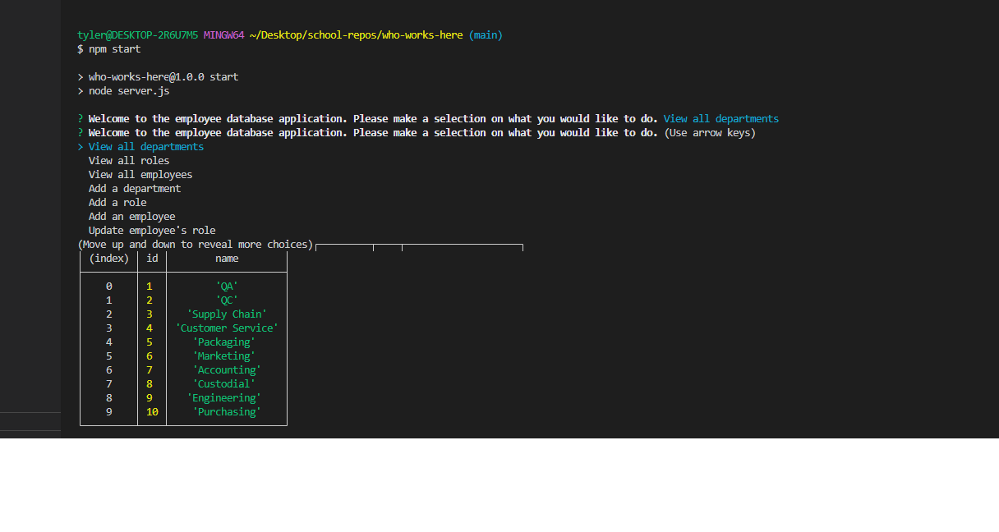

# MYSQL Employee Management System
  

            
## Table of Contents:
1. [Description](#description)
2. [Installation](#installation)
3. [Usage](#usage)
4. [Contributing](#contributing)
5. [Tests](#tests)
6. [Questions](#questions)
7. [License](#license)

## Description:
This project will help you to create and manage a MYSQL database so that you can keep all of your employees up to date.          

## Installation:
To install this application, you need to gitclone the repo. Once you have the repo cloned onto your local machine you wil have to install all the dependancies needed to run this. To do so type npm i into the command line and hit enter. This should download all of the dependancies you need to run the code. You also will need to have MYSQL installed in your local machine so that you have access to the database. Once you have the dependancies installed type node server.js or npm start to run the program.

            
## Usage:
You use this application to stay up to date with employees inside of your workplace and keep track of their roles and managers/salaries.
            
## Contributing:
This was a solo project created for week 12 of my Coding BootCamp through UNH.
            
## Tests:
N/A
    
## Questions:
Email: tylerbedard126@gmail.com

Link to video of application in use:
[Link](https://drive.google.com/file/d/1t7yKpIabhiS9z01Qv0FKyuiN4512WIrP/view)

GitHub: 
[tbedard126](https://github.com/tbedard126)

Email is the best way to contact me.
## License:

  MIT
  
  
  